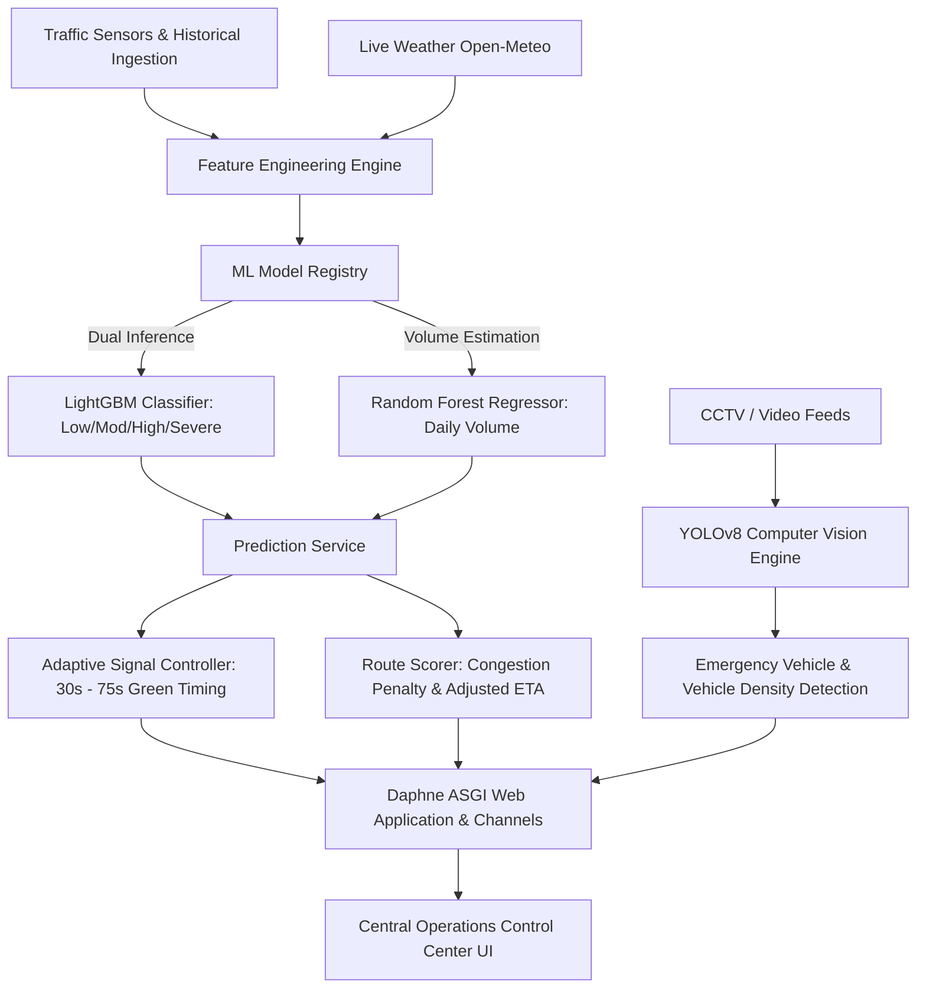

# 🚦 IntelliFlow — Smart Urban Traffic Prediction & Dynamic Signal Control System

[](https://www.python.org/)
[](https://www.djangoproject.com/)
[](https://channels.readthedocs.io/)
[](https://scikit-learn.org/)
[](https://ultralytics.com/)
[](https://www.esri.com/)
[]()
[](LICENSE)

> **Signal Quest Hackathon Project**  
> **Repository:** [https://github.com/prajwalangadi97-crypto/signal-quest-hackathon](https://github.com/prajwalangadi97-crypto/signal-quest-hackathon.git)

---

## 🌟 Executive Summary

**IntelliFlow** is an end-to-end AI-enabled urban traffic prediction, monitoring, and dynamic signal management platform designed for high-density metropolitan road networks (demonstrated across **Bengaluru, India**). 

Traditional traffic lights operate on rigid, pre-programmed timers that cannot adapt to fluctuating traffic waves, weather events, or unexpected bottleneck congestion. **IntelliFlow** replaces legacy timer systems with an adaptive, machine learning-driven traffic operations platform that:

1. **Forecasts next-day volume and congestion levels** across all key city intersections using dual ML models (**LightGBM 4-class classifier** + **Random Forest regressor**).
2. **Dynamically optimizes traffic light green cycles** (from 30s to 75s) to prevent congestion accumulation.
3. **Provides intelligent route planning** with ML penalty factors and congestion-adjusted ETAs.
4. **Enables one-click Emergency Green Corridors** that clear paths for ambulances and first responders.
5. **Integrates Computer Vision (YOLOv8)** for automated vehicle counting and emergency vehicle detection from camera feeds.
6. **Delivers a mission-critical operations dashboard** with live weather telemetry, real-time alert tickers, font-size zoom scaling, and audio-tactile controls.

---

## 📸 System Screenshots

### 1. Operations Dashboard
*Real-time Bengaluru weather telemetry, city volume trend, 4-tier congestion breakdown, live alert ticker, and control actions bar.*


### 2. Live Geospatial Heatmap & Node Inspection
*High-resolution Esri ArcGIS dark map tracking 16 major Bengaluru traffic nodes with color-coded congestion severity and popup telemetry.*

---

## 🏗️ Architecture & Technical Stack



### Technology Breakdown

| Layer | Technologies Used |
| :--- | :--- |
| **Backend Framework** | Python 3.12, Django 5.2, Django REST Framework |
| **Real-Time Asynchronous Engine** | Daphne ASGI Server, Django Channels 4.2 (WebSockets) |
| **Machine Learning** | LightGBM (`BEST_classifier.pkl`), Random Forest (`BEST_regressor.pkl`), Scikit-Learn 1.7, Joblib |
| **Computer Vision** | YOLOv8 (`ultralytics`), OpenCV (`opencv-python-headless`), Pillow |
| **Geospatial & Mapping** | Leaflet.js 1.9, Esri ArcGIS World Dark Gray Canvas, OpenRouteService API |
| **Frontend & Design System** | Signal Grid Custom CSS, HTML5, Vanilla JavaScript, Chart.js 4.4, Web Audio API |
| **Data Ingestion & Storage** | SQLite3 (Development) / PostgreSQL compatible, Open-Meteo Weather API |

---

## 🚀 Core Features & Subsystems

### 1. 🎛️ Operations Command Center (`/dashboard/`)
- **Live Weather Integration**: Real-time temperature, condition, humidity, and wind speed directly from Open-Meteo for Bengaluru.
- **Key Performance Indicators**: Active intersection count, severe congestion warning counts, mean forecasted vehicle volume, and active emergencies.
- **Predictive Trends**: Interactive Chart.js volume history timeline and class probability distribution donuts.
- **Live Congestion Advisory Marquee**: Pulsing real-time bulletin highlighting active traffic hotspots.
- **Control Actions Command Bar**:
  - `⚡ Optimize All Signals`: Synchronizes all 16 intersection signals simultaneously to ML recommendations.
  - `🚨 Simulate Emergency Corridor`: Activates green wave override between Silk Board and M.G. Road.
  - `📊 Export Predictions CSV`: Generates and downloads a `.csv` report of tomorrow's forecasts in real-time.
  - `🔄 Refresh Telemetry`: Queries live sensors across all node feeds.

### 2. 🗺️ Live Geospatial Map (`/map/`)
- Powered by **Esri ArcGIS World Dark Gray Canvas** for a distraction-free, high-contrast dark operations map.
- Monitors **16 key Bengaluru intersections** (Silk Board, M.G. Road, Hebbal Flyover, Koramangala, Indiranagar, Electronic City, Whitefield, etc.).
- Color-coded glowing traffic markers:
  - 🟢 **Low Congestion** (Normal flow)
  - 🟡 **Moderate Congestion**
  - 🟠 **High Congestion**
  - 🔴 **Severe Congestion** (Bottleneck alert)
- Interactive popups showing vehicle density, confidence rating, recommended signal times, and deep-link details.
- Real-time legend toggles allowing operators to filter specific congestion classes on the fly.

### 3. 🚦 Adaptive Signal Control (`/signals/`)
- Displays current signal state, active green duration, ML recommended duration, and timing delta (`+15s`, `+30s`, `-15s`).
- One-click timing adjustment input with immediate database and WebSocket broadcast updates.
- Fail-safe cycle bounds enforced (minimum 30 seconds, maximum 75 seconds).

### 4. 🧭 Intelligent Route Planner (`/routing/`)
- Calculates driving routes and directions using OpenRouteService.
- Applies ML-derived **congestion penalty multipliers** (`penalty_factor > 1.0`) to provide **Adjusted ETAs** reflecting forecasted rush-hour delays rather than misleading empty-road estimates.

### 5. 🚑 Emergency Green Corridor (`/emergency/`)
- Live tracking of priority vehicles (ambulances, fire engines, emergency responders).
- Automatic route clearance that preemptively forces consecutive intersection signals along the vehicle's vector to **GREEN**, minimizing life-saving transit time.

### 6. 👁️ Computer Vision AI (`/vision/`)
- Upload or stream traffic camera images/videos for automated inference.
- Utilizes **YOLOv8** to count cars, motorcycles, buses, and trucks in individual lanes.
- Detects emergency vehicles (sirens/ambulances) to automatically trigger signal preemptions.

### 7. 🔍 Accessibility & Control-Room Ergonomics
- **Font Size Zoom Controller (`[ A− ] 100% [ A+ ]`)**: Scalable typography system allowing instant resizing (88% to 140%) saved in `localStorage`.
- **Live Digital Clock**: Real-time operations clock with seconds precision (`HH:MM:SS IST`).
- **Direct Access Mode**: Seamless auto-authentication middleware eliminating login screens and credential barriers for rapid demonstration.

---

## 🧠 Machine Learning Engine & Artifacts

### Inference Contract
The predictive engine builds an 83-dimensional feature vector for each intersection:
- **Volume Lags**: `volume_lag_1` through `volume_lag_21` (historical sequence tracking).
- **Rolling Statistics**: 7-day and 14-day rolling mean and standard deviation.
- **Calendar Signals**: Day of week, month, day, weekend binary flag.
- **Weather Features**: Encoded weather condition, rain precipitation, temperature.
- **Spatial Embeddings**: Target-encoded area and approach metrics.

### Model Registry Details
Located under `prediction/registry.py` and `models/`:
- **Classifier**: `models/BEST_classifier.pkl` (LightGBM multi-class model).
- **Regressor**: `models/BEST_regressor.pkl` (Random Forest regressor model).
- **Feature Schema**: `metadata/feature_columns.json` (strict 83-column validation).
- **Encoders**: `encoders/area_target_encoder.pkl`, `encoders/weather_encoder.pkl`.

---

## 📁 Repository Directory Structure

```
signal-quest-hackathon/
├── accounts/                  # User management & auto-auth bypass views
├── config/                    # Django ASGI/WSGI settings and root routing
│   ├── asgi.py               # Daphne WebSocket/HTTP ASGI router
│   ├── settings.py           # Core settings, ML paths, middleware pipeline
│   └── urls.py               # Master URL routing table
├── core/                      # Intersections, traffic data models, and API endpoints
│   ├── management/commands/  # CLI tools (seed_from_artifacts, check_deploy)
│   ├── context_processors.py # Navigation & ML status injector
│   ├── middleware.py         # AutoLoginMiddleware (no-login direct access)
│   └── models.py             # Intersection & TrafficData models
├── dashboard/                 # Central Operations Center views & weather API
├── ingestion/                 # Data loading utilities
├── metadata/                  # ML schema and feature_columns.json
├── models/                    # Trained model binaries (.pkl)
│   ├── BEST_classifier.pkl   # LightGBM Classifier
│   └── BEST_regressor.pkl    # Random Forest Regressor
├── prediction/                # Prediction model registry and CLI runners
│   └── registry.py           # Robust dual-model inference registry
├── realtime/                  # WebSockets consumers and channel routing
├── routing/                   # Route planner, ORS client, and congestion scoring
├── signals_app/               # Traffic light controller and emergency mode
├── static/                    # Signal Grid CSS and UI design system
│   └── css/signal-grid.css   # Main cyber/dark theme stylesheet
├── staticfiles/               # Pre-compiled static assets
├── templates/                 # HTML templates
│   ├── base.html             # Topbar, clock, zoom controls, sidebar shell
│   ├── core/map.html         # Esri ArcGIS live heatmap
│   ├── dashboard/home.html   # Main dashboard with alert ticker & actions
│   ├── routing/planner.html  # Route planner UI
│   ├── signals_app/          # Signal dashboard & timing override templates
│   └── vision/               # YOLOv8 upload & detection templates
├── tests/                     # Test suite (test_core.py)
├── vision/                    # YOLOv8 vision service and detection models
├── manage.py                  # Django management script
├── pytest.ini                 # Pytest configuration
├── requirements.txt           # Python dependencies
└── README.md                  # Comprehensive project documentation
```

---

## ⚡ Quick Start & Installation Guide

### Prerequisites
- **Python 3.10+** (Python 3.12 recommended)
- **Git**
- Modern web browser (Chrome, Edge, Firefox, Safari)

### 1. Clone the Repository
```bash
git clone https://github.com/prajwalangadi97-crypto/signal-quest-hackathon.git
cd signal-quest-hackathon
```

### 2. Create and Activate a Virtual Environment
```bash
# Windows
python -m venv venv
venv\Scripts\activate

# macOS / Linux
python3 -m venv venv
source venv/bin/activate
```

### 3. Install Dependencies
```bash
pip install -r requirements.txt
```

### 4. Apply Database Migrations
```bash
python manage.py migrate
```

### 5. Seed Intersections & Traffic Telemetry
```bash
python manage.py seed_from_artifacts
```
*This populates the database with 16 Bengaluru traffic intersections and 560 historical traffic records.*

### 6. Generate ML Predictions
```bash
python manage.py run_predictions --date 2024-08-10
```

### 7. Run the Application
```bash
python manage.py runserver
```

Now open your browser and navigate to:
👉 **`http://127.0.0.1:8000/`**

*No login or registration is required — the full system dashboard and all features will load automatically!*

---

## 🧪 Testing & Validation

The project includes unit and integration tests covering the ML feature contract, model fallback resilience, idempotent data seeding, role access, and route congestion scoring.

Run the test suite via **pytest**:
```bash
python -m pytest
```

Or using Django's test runner:
```bash
python manage.py test
```

**Expected output:**
```
============================= test session starts =============================
collected 8 items

tests\test_core.py ........                                              [100%]
============================== 8 passed in 9.8s ===============================
```

---

## 🌐 REST API Reference

| Endpoint | Method | Description |
| :--- | :---: | :--- |
| `/api/predictions/latest/` | `GET` | Returns forecasted congestion, class, volume, and green times for all nodes |
| `/api/intersections/` | `GET` | Returns list of all active intersections with geo-coordinates |
| `/dashboard/api/weather/` | `GET` | Fetches live weather conditions for Bengaluru from Open-Meteo |
| `/signals/api/status/` | `GET` | Returns real-time signal phase and timing across all monitored intersections |
| `/signals/api/override/` | `POST`| Adjusts signal green duration for an intersection |
| `/routing/api/route/` | `POST`| Calculates route geometry, baseline ETA, congestion penalty, and adjusted ETA |
| `/vision/api/detect/` | `POST`| Submits image/video for YOLOv8 vehicle and emergency detection |

---

## 🏆 Hackathon Highlights

- **Zero-Friction Access**: Removed authentication friction to deliver an instant, live demo experience.
- **Complete End-to-End Flow**: Ingestion ➔ Feature Engineering ➔ Dual ML Inference ➔ Dynamic Signal Control ➔ Geospatial Visualization ➔ Real-Time WebSockets.
- **Enterprise-Grade UI**: Custom cyberpunk dark UI with live ticking operation clock, dynamic font scaler (`A- / A+`), audio feedback, and interactive control actions.
- **Production-Ready ML Registry**: Handles corrupt models gracefully, falling back to volume-based heuristics without crashing the server.

---

## 📄 License
This project is licensed under the MIT License — see the [LICENSE](LICENSE) file for details.
